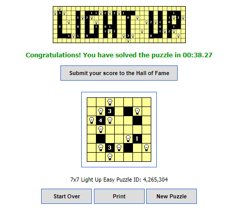
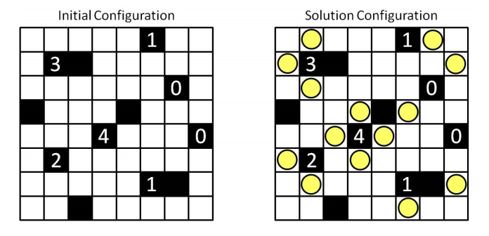

# Strategi Algoritma project  
  
# Topic  
  
Menyelesaikan game puzzle light up(akari) menggunakan algoritma DFS  
  
# Description  
  
Kami akan mencoba memecahkan sebuah game puzzle yang bernama Light Up (Akari). Light up puzzle adalah sebuah permainan yang mempunyai tujuan untuk membuat kotak yang berwarna putih tersinari oleh lampu. Di dalam papan akan ada cell khusus yang berisi angka. Lampu harus diletakkan di sebelah angka tersebut harus sesuai dengan jumlah angka. 

Contoh  jika sel terisi angka 2, maka maksimal hanya 2 lampu yang bisa diletakkan di tiap sisi sel tersebut. Dalam tiap baris dan kolom hanya akan berisi 1 lampu, tidak  boleh lebih.  
  
# Example  
  
  
  
